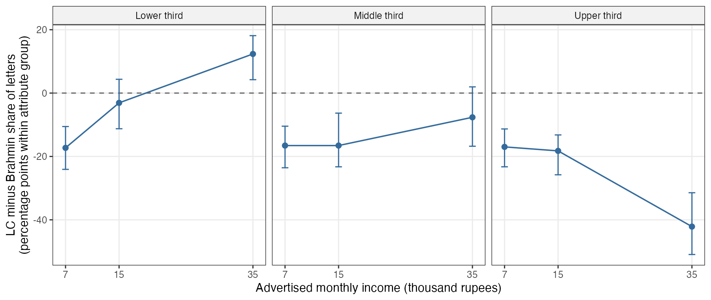
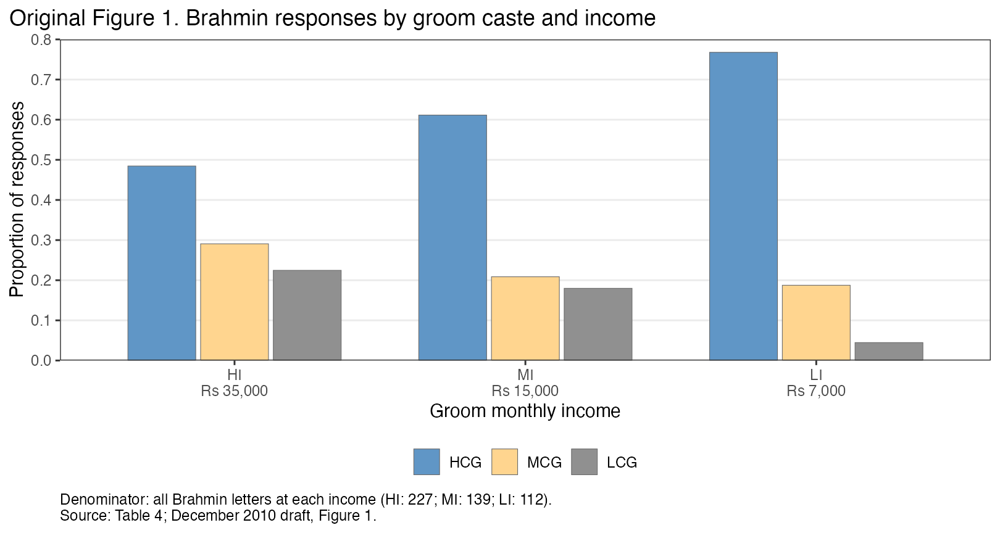
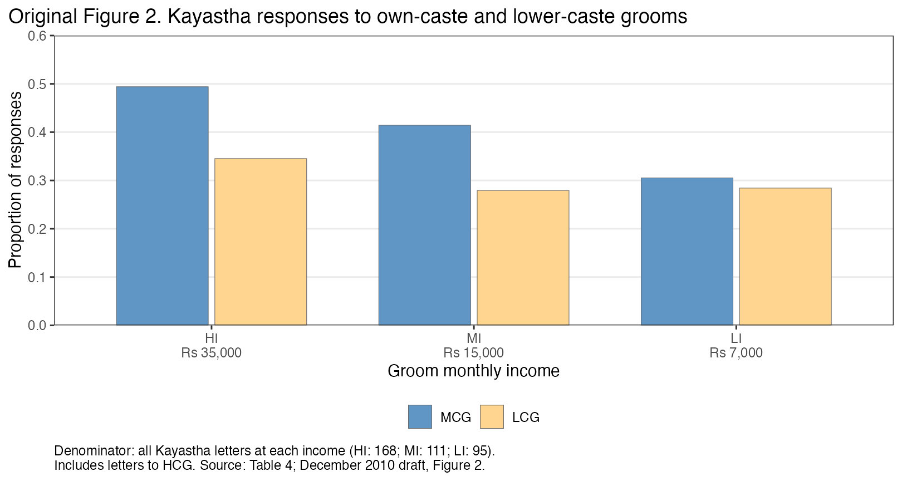
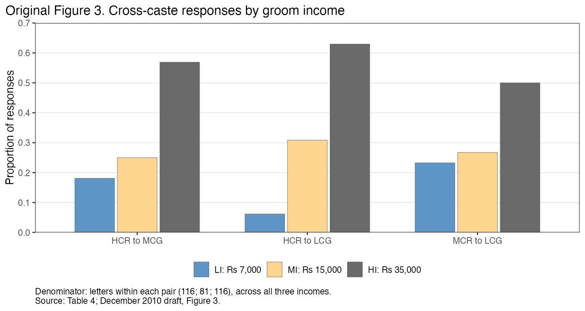

```{r setup, include=FALSE}
knitr::opts_chunk$set(echo = FALSE, message = FALSE, warning = FALSE,
                      fig.pos = "H", out.width = "100%", fig.align = "center")
suppressPackageStartupMessages({library(dplyr); library(tidyr)})
out <- function(name) read.csv(file.path("..", "output", paste0(name, ".csv")), check.names = FALSE)
cmp <- out("comparison_summary")
matched <- function(name) cmp$matched[cmp$table == name]
cells <- function(name) cmp$cells[cmp$table == name]
t4 <- out("table4_counts")
t5 <- out("table5_lpm")
t5_fit <- out("table5_lpm_fit")
t6 <- out("table6_worksheet")
letters <- read.csv(file.path("..", "data", "derived", "letters.csv"))
n_all <- nrow(letters)
n_kept <- sum(!letters$repeat_letter)
n_dropped <- sum(letters$repeat_letter)
fn <- out("comparison_footnote_tests")
bad_fn <- filter(fn, responder_caste == "MC", hypothesis == "MCG-LI = LCG-LI")
num <- function(x, digits = 0) formatC(x, digits = digits, format = "f", big.mark = ",")
rs <- function(x, rounding = -2) num(round(x * 1000, rounding))
count <- function(g, caste) t4[[caste]][t4$groom == g]
headline <- function(x) filter(x, responder_caste == "HC", groom_caste == "LC", income_level == "HI")
unc <- headline(out("audit_table6_uncertainty"))
slopes <- headline(out("audit_table6_segment_slopes"))
forms <- headline(out("audit_table6_alternative_forms"))
all_letters <- headline(out("audit_table6_with_repeat_letters"))
quality <- filter(out("quality_compensation_halves"), responder_caste == "HC",
                  groom_caste == "LC", income_level == "HI")
design <- data.frame(caste = rep(c("HC", "MC", "LC"), each = 3), income = rep(c(7, 15, 35), 3))
low <- min(design$income)
mid <- sort(unique(design$income))[2]
high <- max(design$income)
table6_hi <- t6$HI[t6$pair == "HCR-LCG"]
het <- out("heterogeneity_counts")
received <- out("headline_letters_received")
destinations <- out("headline_letter_destinations")
cross_facts <- filter(out("headline_cross_caste_shares"), sample == "paper (1,123 letters)")
cross_all <- filter(cross_facts, responder_caste == "All")
cross_inclusive <- filter(out("headline_cross_caste_shares"), sample == "all letters (1,366)", responder_caste == "All")
contact_elasticity <- filter(out("headline_income_elasticities"), responder_caste == "HC", groom_caste == "LC")
hgap <- out("heterogeneity_brahmin_gaps")
hcross <- out("heterogeneity_crossings")
hinterval <- out("heterogeneity_intervals")
hfrequency <- out("heterogeneity_crossing_frequency")
htests <- out("heterogeneity_tests")
hdirection <- filter(out("heterogeneity_directions"), specification == "retained")
high_gap <- filter(hgap, groom_income == 35000)
bottom <- filter(high_gap, attribute_group == "T1")
upper <- filter(high_gap, attribute_group == "T3")
bottom_interval <- filter(hinterval, attribute_group == "T1", groom_income == 35000)
upper_interval <- filter(hinterval, attribute_group == "T3", groom_income == 35000)
bottom_cross <- filter(hcross, attribute_group == "T1")
share_direction <- function(caste, group, direction) {
  filter(hdirection, responder_caste == caste, attribute_group == group,
         .data$direction == .env$direction)$share
}
het_count <- function(spec, group, groom) {
  filter(het, specification == spec, responder_caste == "HC", attribute_group == group,
         groom_income == 35000, groom_caste == groom)$letters
}
table_print <- function(x, caption, digits = 2, align = NULL) {
  cat("\\begin{table}[H]\n\\centering\n\\small\n\\caption{", caption, "}\n", sep = "")
  print(knitr::kable(x, format = "latex", booktabs = TRUE, row.names = FALSE,
                     digits = digits, align = align))
  cat("\n\\end{table}\n")
}
```

\begin{abstract}
Can higher income compensate for caste barriers in marriage search? We reproduce the
principal tables in Dugar, Bhattacharya, and Reiley's matrimonial-advertisement experiment
and assess what its contacts reveal about this trade-off. Own caste receives the largest
pooled share of letters within every respondent caste. That pattern does not distinguish
own-caste attachment from a preference for rank or anticipated acceptance. A simple contact
model shows how different caste valuations can generate identical letters when acceptance
beliefs are unobserved. The reported income compensation therefore requires assumptions
beyond reproduction of the response curve. It also depends on extrapolation and conceals
opposite subgroup rankings: at Rs `r rs(high, 0)`, the lower Brahmin attribute third sends
`r bottom$LC` letters to the lower-caste groom and `r bottom$HC` to the Brahmin groom, while the
upper third sends `r upper$LC` and `r upper$HC`. The experiment documents caste sorting
and income responsiveness in first contacts; it does not separately identify a monetary
valuation of caste status.
\end{abstract}

# Introduction

Can economic gains overcome caste barriers in marriage, and how much income would
compensate for crossing those barriers? @dugar2012 address these questions with fictitious
matrimonial advertisements that vary groom caste and income. The concern motivating the
experiment is that caste prejudice excludes otherwise desirable partners. Its substantive
claim is that higher income can offset that exclusion: the abstract describes a reduction
in discriminatory behavior, and the introduction interprets the responses as substitution
between caste status and groom income. Quantifying that substitution would help distinguish
an absolute barrier from one that economic incentives can overcome.

The principal response counts, regressions, and compensation calculations reproduce.
The interpretive difficulty is that a letter initiates a search rather than chooses a
spouse from attainable alternatives. A family may write because it values a groom, expects
acceptance, or has few attractive alternatives. Caste and income can affect each of those
considerations. The experiment observes their combined consequence for contact, without
separating a family's caste valuation from its expectations about the other side.

Three findings organize this note. First, own caste is the largest pooled destination for
each respondent caste. In the Brahmin own-versus-LC comparison, attachment to own caste
and attraction to higher rank both favor the Brahmin groom. The other respondent
castes make that distinction substantively relevant, although their contact patterns also
reflect anticipated acceptance. Second, a simple model demonstrates that different caste
valuations and acceptance beliefs can produce identical contact decisions. This limits the
preference interpretation of the authors' monetary estimates even if their contact effects
are causal. Third, the Table 6 calculation depends on extrapolation and aggregation.
Different Brahmin attribute groups rank the same high-income ads in opposite order.

The distinction between own-caste preference and rank matters for the economic consequences
of caste. In the same newspaper market, @banerjee2013 estimate strong own-caste preferences
and use a matching model to show how those preferences can coexist with small equilibrium
costs when suitable partners are available within caste. Their evidence concerns an earlier
sample and includes evaluation of incoming letters, which already signal interest.
It does not identify the mechanism behind the later experiment's outgoing contacts.
It does establish why a preference trade-off and a cost realized in equilibrium are different
questions. We use that distinction to assess the authors' claims, without treating any
particular search mechanism as established by the letters.^[References to Dugar et al.'s
sections, tables, figures, and pages use the December 2010 author version,
\url{https://davidreiley.com/papers/CantBuyMeLove.pdf}. The published journal text has not
been separately compared.]

# The experiment, its outcomes, and its claims

## Advertisements, respondents, and the observed decision

The authors placed nine fictitious brides-wanted advertisements in *Anandabazar Patrika*,
a Bengali-language newspaper. The profiles cross three caste categories with three monthly
incomes: Rs `r rs(low, 0)`, Rs `r rs(mid, 0)`, and Rs `r rs(high, 0)`.
We denote these income levels LI, MI, and HI, respectively.
Each profile appeared in two editions, producing eighteen placements. The data identify the
editions as 2 and 16 September 2007. We use the paper's codes HC, MC, and LC for the high-,
middle-, and lower-caste categories, and R and G for respondent and groom. HC and MC denote
Brahmin and Kayastha. The earlier draft identifies LC as Namasudra; the 2010 draft calls the
category Scheduled Caste. We retain the category code when comparing versions rather than
silently treating those labels as interchangeable.

All profiles describe government employment without specifying the job. The low-income
profiles advertise a bachelor's degree; the other profiles advertise a master's degree.
The low-to-middle comparison therefore changes education as well as income. Ages of
30--32 and heights of 64--66 inches were assigned within caste, according to the paper.
There is one profile for each caste--income combination, repeated in the second edition,
rather than several independently constructed profiles per combination
[@dugar2012, author draft, section 3, pp. 10--16].

Interested families could send a letter to the advertisement's post-office box. The
experimental advertisements did not say "caste no bar." They appeared among real
advertisements in a newspaper that groups matrimonial notices by caste and sub-caste.
The outcome is a first letter, before a meeting, acceptance, or marriage. We do not observe
which columns a family read, which real advertisements it considered, or whether it contacted
other advertisers. Posting the advertisements in the same edition makes them available;
it does not establish that every family saw all of them.

## Sample and outcomes

The advertisements received `r num(n_all)` letters. The data record the destination ad,
respondent caste, newspaper edition, and reported bride and family attributes. Each letter
identifies one contact; it does not establish that the family considered and rejected the
other eight experimental ads.

Excluding the `r num(n_dropped)` flagged letters yields the paper's
`r num(n_kept)`-letter sample: `r sum(t4$HC)` HC, `r sum(t4$MC)` MC, and
`r sum(t4$LC)` LC responses. The paper describes excluding 47 non-unique letters from
22 respondents and letters from other caste groups. The exclusion indicator does not distinguish those
reasons, and family identifiers are unavailable. We can reproduce the retained sample but
cannot determine the reason for each excluded letter
[@dugar2012, author draft, section 4 and footnote 12, pp. 16--17].

The authors also collected real advertisements to describe the market and inform the
experimental profiles. That collection does not record each respondent's available alternatives.

Table 4 counts letters. Table 5 fits a separate saturated linear probability model for
each respondent caste, with eight groom indicators and LCG-LI as the reference category.
Its fitted values equal shares of that caste's retained letters sent to each ad. They sum
to one across the nine ads. These are not response rates among all exposed families,
because nonresponding readers are not observed. Original Figures 1--2 condition on groom income;
original Figure 3 conditions on a respondent--groom caste pair. Those denominators must remain
distinct when interpreting the plots.

## From a contact share to an income compensation

Let $N_{c,g,y}$ be retained letters from respondent caste $c$ to the groom of caste $g$
with advertised income $y$. The fitted response probabilities in Table 5 are
\[
\widehat p_{c,g}(y)=\frac{N_{c,g,y}}{\sum_{g',y'}N_{c,g',y'}}.
\]
They describe the destinations of retained contacts, conditional on a letter entering the
sample. They are not the probability that an exposed family writes or that a marriage occurs.

The authors define discrimination behaviorally: fewer letters from higher-caste respondents
to a lower-caste groom than to a comparable own-caste groom. More letters to richer
lower-caste grooms constitute a reduction in that discriminatory behavior under their
definition. A change in behavior need not mean a change in the underlying taste for caste.
The stronger interpretive step is to read the response gradient as compensation for lost
status [@dugar2012, pp. 5--6, 21--23].

Table 6 operationalizes compensation as the additional groom income predicted to equalize
aggregate responses. With the own-caste groom's income fixed at $y_0$, the target is
\[
p_{c,g}(y_0+\Delta^{\mathrm{contact}})=p_{c,c}(y_0).
\]
In the high-income Brahmin--LC comparison, the reported additional amount is
Rs `r rs(table6_hi, -1)` on top of Rs `r rs(high, 0)`. The authors describe such amounts
as compensation to higher-caste respondents. An income that equalizes aggregate contact
shares is not generally the mean or median income that makes individual families indifferent
between attainable partners. Nor is groom income a cash payment to a respondent.

## Numerical reproduction

All `r cells("Table 4")` response-count cells in original Table 4 reproduce exactly.
Table 5's coefficients, uncertainty entries, and fit statistics match to printed precision.
Table 6 reproduces using the authors' worksheet rules, including rounding and two
significance-based zeroing choices in the Kayastha panel. Those rules change the reported
monetary amounts without changing the underlying contacts. The appendix reports the
reproduced exhibits, the unrestricted calculation, and the limited reporting discrepancies.
The central issue is the interpretation of results that reproduce.

# What would identify a valuation of caste?

## Readership and the response baseline

Who reads the advertisements matters for the baseline against which contacts are compared.
For one newspaper edition, let $M_c$ be the number of eligible searching families of caste
$c$, $e_{cj}$ the fraction exposed to ad $j$, and $r_{cj}$ the average probability of
writing among those exposed. Before sample exclusions, expected letters satisfy
\[
\mathbb E[L_{cj}]=M_c e_{cj}r_{cj}.
\]
For a fixed groom, the caste composition of received letters depends on the relative
$M_c$ as well as exposure and response behavior. A high Brahmin share of its letters cannot
be interpreted as overrepresentation without a benchmark for eligible, exposed families.
The Brahmin share of all newspaper readers would only approximate that population.

Within a respondent caste and edition, $M_c$ cancels in the ratio of expected counts across two ads.
Equal exposure would also cancel $e_{cj}$. Thus the overall Brahmin readership share is
unnecessary for that relative comparison under common exposure. But caste-specific reading
of columns can change exposure across ads; conditional response still includes attention,
acceptance beliefs, and alternatives. The retained-letter analysis additionally requires
attention to the exclusion rule. These are problems in interpreting this market's response
baseline, independently of whether it represents a wider population.

A one-third own-caste benchmark does not follow from the experimental menu alone. It
requires exchangeability of exposure and contact opportunities across the three groom
castes at each income, including acceptance prospects and other profile attributes.
Having three own-caste profiles and six other-caste profiles establishes availability in
the newspaper, not those conditions.

## A contact decision and an observational equivalence

Consider a family $i$ and groom $j$. Let $A_{ij}$ indicate that the family considers the ad,
$q_{ij}$ its perceived probability that contact leads to an attainable match, $S_{ij}$ the
value of that match relative to continuing search, and $k_{ij}$ the cost of initiating contact.
A simple decision rule is
\begin{equation}
D_{ij}=A_{ij}\mathbf 1\{q_{ij}S_{ij}\geq k_{ij}\}.
\label{eq:contact}
\end{equation}
The rule treats each contact as a marginal opportunity with a fixed continuation value.
It permits several contacts and abstracts from interactions among simultaneous applications.
It is an illustrative model, not an estimated description of these families.

Write match surplus as
\[
S_{ij}=\beta_i y_j+\alpha_i\mathbf 1\{g_j=c_i\}+\gamma_i s(g_j)
       +v_i(x_j)-O_i,\qquad \beta_i>0.
\]
Here $\alpha_i$ values own caste, $\gamma_i$ values a specified caste-rank score $s$, $x_j$
contains other groom attributes, and $O_i$ is the value of continuing search. Income is
measured in thousands of rupees per month. A caste ordering does not supply a cardinal
status scale, and these caste terms can represent perceived compatibility or social
sanctions as well as the respondent's prejudice. For a Brahmin family, the additional LC
groom income that holds match value constant, with other attributes fixed, is
\[
\Delta_i^{\mathrm{match}}
=\frac{\alpha_i+\gamma_i\{s(HC)-s(LC)\}}{\beta_i}.
\]
This is an income equivalent in match utility. Its interpretation as cash willingness to
pay would require a further link between groom earnings and the family's welfare.

Unobserved acceptance beliefs prevent recovery of this quantity without restrictions.
To see the problem directly, take positive surpluses $S_{ij}>0$ and any nonnegative
increment $d_{ij}$. Define
\[
S'_{ij}=S_{ij}+d_{ij},\qquad
q'_{ij}=q_{ij}\frac{S_{ij}}{S_{ij}+d_{ij}}.
\]
The transformed beliefs remain between zero and one and satisfy
$q'_{ij}S'_{ij}=q_{ij}S_{ij}$. Holding consideration and costs fixed therefore gives exactly
the same contact decisions. Starting with no caste terms, an increment
$d_{ij}=a_i\mathbf 1\{g_j=c_i\}+b_i s(g_j)$, with nonnegative coefficients and rank score,
can introduce own-caste or rank valuations while leaving every contact unchanged through
the corresponding beliefs. Match compensation changes; observed letters do not.

This construction establishes nonidentification in the illustrative model when beliefs
are unrestricted. It does not show that the constructed beliefs are the families' actual
beliefs, that every search model is unidentified, or that caste prejudice is absent.
Restrictions on acceptance probabilities can rule out the equivalence. The experiment
contains no acceptance outcomes or elicited beliefs with which to impose or assess them.
Fear of another family's prejudice may itself be a caste barrier, but it does not identify
the letter writer's own valuation of caste.

## Which assumptions could permit estimation?

Preference compensation could be estimated under a specified model in which consideration
is observed or credibly restricted, acceptance and contact costs do not vary with the
attributes used to identify preferences (or their variation is separately identified),
and the distribution of utility heterogeneity and contact shocks is specified. Income and
caste must enter the same identified utility model. A coefficient ratio would then have a
model-based interpretation; a ratio of saturated contact-share differences is not automatically
that ratio. Different families writing to different ads does not, by itself, preclude
estimating population preferences under such a model.

Missing nonrespondents also need not defeat every relative-preference model. Under a
correctly specified homogeneous multinomial logit with full consideration, mutually exclusive
choices, and independence of irrelevant alternatives, ratios of inside-option probabilities
cancel the outside-option denominator. But these families may contact several advertisers,
consider different ads, and face different acceptance prospects. Treating every unchosen
experimental profile as an observed rejection assumes away those problems. A flexible fit
to the nine shares cannot test those assumptions.

Observing consideration directly is not the only possible route. @abaluck2021 show that,
within specified consideration models, asymmetries in how choices respond to changes in
competing alternatives' attributes can identify consideration and preferences separately.
The identifying information is in those cross-responses under the model's restrictions.
Repeating the same experimental menu does not supply independent changes in rival ads'
attributes with which to recover that information. Applying such a model here would require
an argument for identification beyond fitting the observed shares.

Search costs include the time and effort of inquiry and subsequent negotiation, not just
postage. A shorter search horizon changes the continuation value $O_i$; the availability
of suitable own-caste partners can change both $O_i$ and acceptance prospects. Background
conditions common across ads do not automatically explain a caste contrast. The relevant
question is whether they alter relative contact incentives or the composition of who writes.
Holding the market fixed can suffice for an experimental effect on contacts. Predicting the
cost of caste in completed matches requires a model of both sides and the available partners.
The authors' appeal to simultaneously available own-caste ads and caste differences in
average income does not establish which alternatives each respondent saw or could attain
[@dugar2012, pp. 26--27]. The real-ad collection is from May--June; it does not reconstruct
the September respondents' choice sets.

Related studies obtain leverage from additional observations and restrictions. Speed-dating
data make encounters explicit [@fisman2008]. Browsing and reply histories in online dating
permit tests of strategic initiation; those tests need not find strategic behavior, so it
cannot simply be presumed here [@hitsch2010matching; @hitsch2010click]. In this newspaper
market, @banerjee2013 find more evidence of strategic behavior in answering ads than in
evaluating incoming letters and compare shortlisting with elicited rankings [pp. 57--59].
Their matching analysis then distinguishes preference trade-offs from equilibrium costs.

The existing data permit checks of income-specific patterns, editions, exclusions, and
respondent attributes. Those checks can challenge a simple account of contact; they cannot
validate unobserved exposure or beliefs. Recording ad views would measure exposure, and
following replies and eliciting beliefs would constrain the acceptance channel, although
replies observed only after contact would still be selected. Randomized information about
acceptance could supply additional variation if it changes beliefs without directly changing
match value. A "caste no bar" message does not automatically satisfy that exclusion: it
may also change the appeal of the groom's family. Independently replicated profiles and
variation in competing menus would help separate profile effects and substitution. These
are specific requirements for stronger inference, not adjustments available by adding
controls to the current letters.

# What the response patterns establish

## Own caste and higher rank

Table \ref{tab:destinations} holds respondent caste fixed and shows where its letters went.
Own-caste grooms receive the largest share within each respondent caste when incomes are pooled.
This establishes own-caste concentration in recorded contacts. A model with only a common
positive taste for higher rank, comparable non-caste attributes, and equal contact
opportunities would instead favor Brahmin grooms for every respondent caste. The pooled
pattern challenges that simple account. It does not distinguish an own-caste taste from
caste-specific consideration or anticipated acceptance.

```{r letter-destinations, results='asis'}
destination_display <- destinations |>
  select(responder_caste, groom_income, denominator, groom_caste, share) |>
  pivot_wider(names_from = groom_caste, values_from = share) |>
  transmute(Respondent = recode(responder_caste, HC = "Brahmin", MC = "Kayastha", LC = "LC"),
    `Income (Rs)` = ifelse(is.na(groom_income), "All", num(groom_income)),
    Letters = denominator, `To Brahmin (%)` = 100 * HC,
    `To Kayastha (%)` = 100 * MC, `To LC (%)` = 100 * LC)
table_print(destination_display,
  "Destinations of retained letters within respondent caste and income.\\label{tab:destinations}",
  digits = c(0, 0, 0, 1, 1, 1))
```

\noindent\textit{Notes:} Each row uses letters from the specified respondent caste and,
except for "All," to grooms at the specified income. Percentages sum to 100 within a row.
The "All" rows pool incomes; each groom caste has three profiles repeated in two editions.
Other profile attributes are not identical, and the lowest income also carries lower education.

The distinction between own caste and higher rank is especially important for Kayastha
and LC respondents. For Brahmins, both favor the same groom caste. The pooled own-caste
ranking does not hold at every income: at Rs `r rs(low, 0)`, Kayastha respondents send
`r count("HCG-LI", "MC")` letters to the Brahmin ad and
`r count("MCG-LI", "MC")` to their own-caste ad. A claim that own caste always dominates
would therefore also overstate the data.

The authors discuss lower-caste behavior explicitly. Footnote 13 acknowledges own-caste
concentration and the possibility that anticipated rejection discourages upward contacts.
It says that separating the status incentive from discouragement requires information
about men's preferences that the study lacks. Footnote 14 nevertheless interprets the
greater response to poorer higher-caste grooms as willingness to forgo income for status
[@dugar2012, pp. 18--19]. For example, LC respondents send
`r count("HCG-MI", "LC")` letters to the Brahmin ad at Rs `r rs(mid, 0)` and
`r count("HCG-HI", "LC")` at Rs `r rs(high, 0)`. Both profiles advertise a master's degree.

Within that comparison groom caste is unchanged. Greater contact with the poorer groom
does not demonstrate an exchange of income for higher status. It is also consistent with
targeting a more attainable prospect. Such behavior can coexist with a desire to marry up,
but neither motive is identified by the inverse income gradient. The same standard applies
to Brahmin contacts: anticipated acceptance and consideration must be addressed before
interpreting their response gaps as caste valuations. Neither a common rank preference
nor a purely horizontal preference is separately established by the full contact matrix.

## Income responsiveness and the meaning of discrimination

At Rs `r rs(high, 0)`, the Brahmin ad receives `r count("HCG-HI", "HC")` Brahmin letters
and the LC ad `r count("LCG-HI", "HC")`; at Rs `r rs(low, 0)` the counts are
`r count("HCG-LI", "HC")` and `r count("LCG-LI", "HC")`. Holding respondent caste fixed
removes its overall readership size as an explanation of these within-caste differences
under common exposure. It does not remove differences in consideration or expected
acceptance. The low-to-high comparison also changes education.

A descriptive income elasticity can summarize the recorded pattern. Between the two
master's-degree LC profiles, the log-change slope in Brahmin contacts is
\[
\frac{\log\{N_{HC,LC,35}/N_{HC,LC,15}\}}{\log(35/15)}
= `r num(contact_elasticity$arc_15k_to_35k, 2)`.
\]
This finite contrast is not automatically a causal elasticity for changing the income of
an otherwise fixed ad, or an elasticity of demand for completed marriages. With valid
assignment, a total effect on contacts would be a meaningful experimental outcome even
if it operates through attention or beliefs. Here each caste--income cell contains one
profile repeated in two editions; letter-level precision does not provide independent
profile replication.

Even if this were an identified contact effect, a positive income response could occur
with a fixed caste penalty in utility. That is consistent with the authors' behavioral
definition of reduced discrimination. It does not establish a weakening of caste tastes,
and the mapping from contact to income compensation still requires the assumptions above.

## How many contacts cross caste?

Of the retained letters, `r num(100 * cross_all$cross_caste, 1)` percent went to a groom
from a different caste and `r num(100 * cross_all$own_caste, 1)` percent to an own-caste groom.
As shares of all retained letters, `r num(100 * cross_all$down, 1)` percent went to a
lower-caste groom and `r num(100 * cross_all$up, 1)` percent to a higher-caste groom.
These are letters expressing initial
interest, not completed marriages or the fraction of newspaper readers willing to marry
outside caste.

```{r letters-received, results='asis'}
received_display <- received |>
  mutate(groom_caste = c("Brahmin", "Kayastha", "LC", "All")) |>
  transmute(`Groom caste` = groom_caste, `Out-of-caste letters (%)` = 100 * out_of_caste_share,
            `Letters received` = total)
table_print(received_display,
  "Share of letters from out-of-caste respondents, pooling incomes and editions.\\label{tab:received}",
  digits = c(0, 1, 0))
```

\noindent\textit{Notes:} The original retained sample is used. Out-of-caste means that
respondent and groom caste differ. Each groom caste has three income profiles, each placed
in two editions. Each percentage uses letters received by that groom caste as its denominator;
the overall percentage uses all `r num(cross_all$letters)` retained letters.
Including all `r num(cross_inclusive$letters)` recorded letters gives an out-of-caste share
of `r num(100 * cross_inclusive$cross_caste, 1)` percent;
the exclusion reasons remain unresolved.

These percentages describe the composition of letters received. A groom caste's own-caste
share depends on the relative numbers of potential respondents from each caste as well as
their contact behavior. The within-respondent comparisons above use a different denominator.

## How much do extrapolation and the response curve matter?

For Brahmin responses to the LC groom at the highest income, the unrestricted formula gives
an additional Rs `r rs(unc$estimate)`, implying a total income of approximately
Rs `r rs(high + unc$estimate)`. The experimental maximum is Rs `r rs(high, 0)`.
The letter-bootstrap interval for the additional amount is approximately
Rs `r rs(unc$lower_boot)`--`r rs(unc$upper_boot)`. It quantifies sampling variation conditional
on the observed advertisements and the letter-level independence assumption; it does not
include uncertainty from changing the response curve or from ad-specific effects.

```{r sensitivity, results='asis'}
sensitivity <- data.frame(
  Calculation = c("Low-to-high slope (unrestricted Table 6)", "Low-to-middle slope",
                  "Middle-to-high slope", "Share linear in log income"),
  `Additional income` = c(unc$estimate, slopes[["LI-MI"]], slopes[["MI-HI"]], forms$compensation_log_k),
  check.names = FALSE
)
table_print(sensitivity, "Response-curve sensitivity: HCR--LCG at high income, thousand rupees.\\label{tab:sensitivity}", digits = 1)
```

These are alternative extrapolations, not four independently observed prices.
The first three divide the same observed gap by different segment slopes. The last fits
share as a linear function of log income and solves for the income matching the observed
own-caste share. The low-to-middle slope also spans a change in advertised education.
The experiment establishes responses at the three tested incomes; it does not select the
curve outside that support.

The exclusions matter too. Retaining all recorded letters changes this unrestricted
additional-income estimate to approximately Rs `r rs(all_letters$compensation_all_letters)`.
That sensitivity does not establish that the excluded letters belong in the main sample:
the underlying exclusion reasons remain unresolved. Letter-clustered and multinomial
inference checks do not overturn the principal response contrasts.
Repeating the same profiles in two editions does not independently replicate each treatment
with new profiles.

## Aggregate and subgroup response rankings

### Grouping respondents by reported attributes

The original section 4.4 predicts that respondents with stronger attributes require more
compensation, and describes adjusted trade-off estimates as close to the unadjusted ones
[@dugar2012, pp. 23--25]. Its underlying estimates are not reported. We examine whether
aggregate responses conceal different rankings across respondent groups: which ad attracts
more letters from a given group at each tested income?

We summarize ten reported bride and family attributes using their first principal component,
with median imputation for missing values. We form thirds within respondent
caste, retaining tied scores together. Brahmin group sizes are
`r paste(num(high_gap$group_letters), collapse = ", ")`. The index summarizes reported
attributes; it is not a validated measure of desirability. Education groups provide a
comparison that does not require an index. Full construction and missingness details are
in the appendix.

### A reversal at an observed income

At Rs `r rs(high, 0)`, the lower third of Brahmin respondents sends `r bottom$LC`
letters to the LC ad and `r bottom$HC` to the Brahmin ad. In the upper third the counts
are `r upper$LC` and `r upper$HC`. The LC-minus-Brahmin difference is
`r num(100 * bottom$difference, 1)` percentage points of lower-third letters
(bootstrap 95% interval `r num(100 * bottom_interval$lower, 1)` to
`r num(100 * bottom_interval$upper, 1)`), compared with
`r num(100 * upper$difference, 1)` points in the upper third
(`r num(100 * upper_interval$lower, 1)` to `r num(100 * upper_interval$upper, 1)`).
The middle and upper groups favor the Brahmin ad at every tested income.

```{r subgroup-figure, fig.cap='Brahmin respondents: LC minus Brahmin response shares within each attribute third. Each denominator includes all retained letters from that third across the nine ads. Positive values favor the LC ad; zero denotes equal counts. Points are observed at the three tested incomes; lines interpolate between them. Bars are pointwise 95% percentile intervals from 2,000 letter-level bootstrap draws within respondent caste, re-estimating imputation, the PCA and group boundaries. They condition on the observed profiles and assume independent letters. The low-to-middle comparison also changes groom education.'}

```

A direct test compares the distribution of Brahmin and LC destinations across the three
attribute groups at each income. The Holm-adjusted Fisher p-values are
`r paste(formatC(htests$p_holm, format = "g", digits = 3), collapse = ", ")`, in ascending
income order. These are conditional tests among letters to the two ads, with the estimated
group assignments held fixed. They test subgroup differences, not whether one subgroup's
result is significant and another's is not. The bootstrap propagates uncertainty in the
attribute index separately; neither procedure supplies randomization inference over new ads.

The lower-group reversal persists in both editions, when excluded letters are included,
when education is omitted from the PCA, and among complete cases. Table
\ref{tab:heterogeneity-checks} reports the high-income counts rather than a sequence of
significance thresholds. Complete-case comparisons retain the original scores and boundaries
and change the sample. They therefore address sensitivity to imputation, not selection
into reporting all attributes.

```{r subgroup-checks, results='asis'}
spec_order <- c("retained", "edition_1", "edition_2", "all_recorded", "excluded", "no_education", "complete_case")
spec_labels <- c("Retained", "Edition 1", "Edition 2", "All recorded", "Excluded only", "PCA without education", "Complete cases")
checks <- filter(het, specification %in% spec_order, responder_caste == "HC",
                 attribute_group %in% c("T1", "T3"), groom_income == 35000, groom_caste %in% c("HC", "LC")) |>
  select(specification, attribute_group, groom_caste, letters) |>
  pivot_wider(names_from = c(attribute_group, groom_caste), values_from = letters) |>
  arrange(match(specification, spec_order))
display_checks <- data.frame(Sample = spec_labels, `Lower: Brahmin` = checks$T1_HC,
  `Lower: LC` = checks$T1_LC, `Upper: Brahmin` = checks$T3_HC, `Upper: LC` = checks$T3_LC,
  check.names = FALSE)
table_print(display_checks, "Letters at Rs 35,000 from lower and upper Brahmin attribute groups.\\label{tab:heterogeneity-checks}", digits = 0)
```

\noindent\textit{Notes:} Edition, exclusion, and complete-case checks use the retained
sample's scoring parameters and boundaries. The no-education specification re-estimates
the index and boundaries on retained letters. Complete cases retain
`r sum(distinct(filter(het, specification == "complete_case", responder_caste == "HC"), attribute_group, group_letters)$group_letters)`
of `r sum(high_gap$group_letters)` Brahmin letters. Excluded letters are a sensitivity
sample, not an established
correction to the original exclusions.

Education alone gives the same ordering, with a small low-education group. At the highest
income, Brahmin letters reporting less than a bachelor's degree go
`r het_count("education", "Below bachelor's", "LC")` to the LC ad and
`r het_count("education", "Below bachelor's", "HC")` to the Brahmin ad. Letters reporting
a master's degree or doctorate go `r het_count("education", "Master's or doctorate", "LC")`
and `r het_count("education", "Master's or doctorate", "HC")`, respectively. These are
selected groups of observed letter writers, not estimates of the causal effect of bride
education on caste preferences.

### The direction of crossing caste

The attribute gradient concerns the direction of contact as well as whether a letter crosses
caste. Among Kayastha respondents, the share sent upward to Brahmin grooms rises from
`r num(100 * share_direction("MC", "T1", "Up"))` percent in the lower third to
`r num(100 * share_direction("MC", "T3", "Up"))` percent in the upper third.
Among LC respondents, the upward share rises from
`r num(100 * share_direction("LC", "T1", "Up"))` to
`r num(100 * share_direction("LC", "T3", "Up"))` percent. The appendix reports all
three destinations, including own-caste letters, for every group.

These patterns qualify an interpretation based only on horizontal own-caste preferences.
They do not establish a vertical preference for higher caste: respondents with different
attributes may also face different acceptance prospects, search costs, or alternatives.
The design observes which advertised profiles attract which letters, not which feasible
partners each family would choose.

## A crossing within support answers a different question

Piecewise-linear interpolation puts the lower Brahmin third's same-income crossing at
Rs `r num(bottom_cross$lower_income)`. There is no crossing within the tested range for
the middle or upper third. The calculation moves both grooms' incomes together until
$p_{c,c}(y)=p_{c,LC}(y)$. Table 6 instead fixes the own-caste ad's income and raises the
other ad's income. Neither comparison is an individual indifference point.

The crossing is less direct evidence than the observed high-income reversal. Of
`r hfrequency$draws[1]` bootstrap draws, `r hfrequency$no_crossing[hfrequency$attribute_group == "T1"]`
have no lower-third crossing in the tested range. The corresponding numbers for the middle
and upper thirds are `r hfrequency$no_crossing[hfrequency$attribute_group == "T2"]` and
`r hfrequency$no_crossing[hfrequency$attribute_group == "T3"]`. We retain those draws as
outcomes rather than calculating an apparently precise unconditional interval from the
subset that crosses. These frequencies describe the specified resampling exercise; they
are not probabilities that a true crossing exists.

# Implications

The response counts and central calculations reproduce. They establish caste sorting in
first contacts and income responsiveness within particular respondent--groom pairs.
Own caste is the largest pooled destination for every respondent caste, while respondent
attributes substantially change the direction of cross-caste contact. These findings are
compatible with several combinations of own-caste attachment, rank preference, and
anticipated acceptance.

The Table 6 numbers answer an aggregate equal-contact question under an extrapolated
response curve. Interpreting them as individual or average compensation for caste status
requires additional identification. The contact model shows why observing the same letters
can leave preference compensation different. The subgroup reversal adds an empirical
limit: even the ranking of two ads at an observed income changes across respondents.
This is consistent with heterogeneous responses; it does not supply an alternative WTP estimate.

These results support a claim about responses to advertised prospects in this marriage
market. A monetary valuation of caste, a measure of respondents' prejudice, and the cost
of caste barriers in completed matches each require additional evidence and assumptions.

\FloatBarrier
\clearpage
\bibliography{references}

\clearpage
\appendix
\section*{Appendices}
\counterwithin{table}{section}
\counterwithin{figure}{section}
\counterwithin{equation}{section}
\renewcommand{\thetable}{\Alph{section}\arabic{table}}
\renewcommand{\thefigure}{\Alph{section}\arabic{figure}}
\renewcommand{\theequation}{\Alph{section}\arabic{equation}}

# Reproduction exhibits

## Counts and regressions

All `r cells("Table 4")` response-count cells in Table 4 reproduce exactly. Table 5's
`r cells("Table 5")` coefficient and parenthesis entries and all
`r cells("Table 5 fit")` sample-size and fit entries match to printed precision.
Table \ref{tab:counts} reports the counts, and Table \ref{tab:regressions} reports the
regression entries. The main comparison is visible without a model: at
Rs `r rs(high, 0)`, the Brahmin ad attracts `r count("HCG-HI", "HC")` Brahmin letters
and the lower-caste ad attracts `r count("LCG-HI", "HC")`. At
Rs `r rs(low, 0)`, the corresponding counts are `r count("HCG-LI", "HC")` and
`r count("LCG-LI", "HC")`.

```{r counts, results='asis'}
display4 <- t4 |>
  mutate(income_level = factor(income_level, levels = c("HI", "MI", "LI"))) |>
  arrange(income_level, match(groom_caste, c("HC", "MC", "LC"))) |>
  select(Income = income_level, Groom = groom_caste, HCR = HC, MCR = MC, LCR = LC)
table_print(display4, "Reproduction of original Table 4: response letters.\\label{tab:counts}", digits = 0)
```

```{r regressions, results='asis'}
terms <- c("HCG-HI", "HCG-MI", "HCG-LI", "MCG-HI", "MCG-MI", "MCG-LI", "LCG-HI", "LCG-MI", "Constant")
estimates <- t5 |>
  select(term, responder_caste, estimate, se_hc1, p_hc1) |>
  pivot_wider(names_from = responder_caste, values_from = c(estimate, se_hc1, p_hc1)) |>
  arrange(match(term, terms))
display5 <- data.frame(
  Groom = estimates$term, HCR = sprintf("%.4f", estimates$estimate_HC),
  `HC SE` = sprintf("%.4f", estimates$se_hc1_HC),
  MCR = sprintf("%.4f", round(estimates$estimate_MC, 4) + 0), `MC SE` = sprintf("%.4f", estimates$se_hc1_MC),
  LCR = sprintf("%.4f", estimates$estimate_LC), `LC p` = sprintf("%.3f", estimates$p_hc1_LC),
  check.names = FALSE
)
table_print(display5, "Reproduction of original Table 5.\\label{tab:regressions}", align = c("l", rep("r", 6)))
```

\noindent\textit{Notes:} HC and MC uncertainty entries are HC1 standard errors; the
original LC column prints p-values despite its note calling them standard errors.
Stacked observations are `r num(t5_fit$n[t5_fit$responder_caste == "HC"])`,
`r num(t5_fit$n[t5_fit$responder_caste == "MC"])`, and
`r num(t5_fit$n[t5_fit$responder_caste == "LC"])`; reported $R^2$ values are
`r num(t5_fit$r2[t5_fit$responder_caste == "HC"], 2)`,
`r num(t5_fit$r2[t5_fit$responder_caste == "MC"], 2)`, and
`r num(t5_fit$r2[t5_fit$responder_caste == "LC"], 3)`. The omitted category is LCG-LI.

One reported test does not reproduce. Footnote 16 says the low-income Kayastha-versus-LC
comparison is significant at the one-percent level; its reproduced p-value is
`r num(bad_fn$p_reproduced, 2)`. The body text correctly describes no significant difference.
The other `r matched("Footnote F-tests")` footnote tests match the comparison criteria.

## The Table 6 calculation

Let $p_{c,g}(y)$ denote the share of retained letters from respondent caste $c$ sent to a
groom of caste $g$ at monthly income $y$, measured in thousands of rupees. The unrestricted
calculation in footnote 21 is
\begin{equation}
\widehat{\Delta}_{c,g}(y)=
\frac{\widehat p_{c,c}(y)-\widehat p_{c,g}(y)}
{[\widehat p_{c,g}(35)-\widehat p_{c,g}(7)]/(35-7)}.
\label{eq:compensation}
\end{equation}
It converts a response-share gap into extra income by extending the lower-caste ad's
average low-to-high income slope.

Two Kayastha entries depend on rules documented in the authors' calculation worksheet.
It uses coefficients rounded to four decimals, treats the LCG-MI coefficient as zero
because it is insignificant, and zeroes the low-income own-versus-LC gap for the same reason.
Applying those rules reproduces all
`r cells("Table 6")` printed Table 6 entries, including means and standard deviations. Table \ref{tab:compensation} displays
the reconstruction alongside the unrestricted estimates.

```{r compensation, results='asis'}
base6 <- out("table6_compensation")
rounded6 <- out("table6_rounded_unrestricted")
rows6 <- bind_rows(lapply(seq_len(nrow(t6)), function(i) {
  data.frame(Pair = t6$pair[i], Calculation = c("Worksheet", "Unrestricted", "Rounded unrestricted"),
             rbind(t6[i, -1], base6[i, -1], rounded6[i, -1]), check.names = FALSE)
}))
names(rows6)[names(rows6) == "mean"] <- "Mean"
names(rows6)[names(rows6) == "sd"] <- "SD"
table_print(rows6, "Reproduction of original Table 6: additional monthly income, thousand rupees.\\label{tab:compensation}")
```

\noindent\textit{Notes:} Every worksheet entry rounds to its printed counterpart.
"Unrestricted" uses full-precision coefficients and no zeroing; "Rounded unrestricted"
uses four-decimal coefficients and no zeroing. The reported headline is an extra
Rs `r rs(table6_hi, -1)` for an LC groom already advertising Rs `r rs(high, 0)`.

## Figures and their denominators

The following plots reproduce the original response shares. Original Figure 1 divides Brahmin letters by all Brahmin letters at each income.
Original Figure 2 does the same for Kayastha respondents, including letters to the unplotted Brahmin
grooms in the denominator. Its two displayed shares therefore do not sum to one. Original Figure 3
divides by all letters within each displayed respondent--groom caste pair, across incomes.
The plotted values are tested directly against the counts in Table \ref{tab:counts}.

```{r original-figure1, fig.cap='Reproduction of original Figure 1. Brahmin grooms receive the largest share of Brahmin letters at each income. HCG, MCG, and LCG denote the three groom categories; the denominator changes with income.'}

```

```{r original-figure2, fig.cap='Reproduction of original Figure 2. Kayastha grooms receive more Kayastha letters than LC grooms, with almost no gap at low income. Letters to Brahmin grooms remain in each denominator.'}

```

```{r original-figure3, fig.cap='Reproduction of original Figure 3. Higher-income grooms receive more letters in each displayed cross-caste pair. The three bars sum to one within a pair. HCR and MCR denote respondent categories.'}

```

\FloatBarrier


# Attribute construction and supplementary comparisons

The PCA uses height, age, education, complexion, looks, employment, unmarried daughters,
father absence, residence ownership, and car ownership. Ordinal attributes enter as numerical
scores. Missing values receive the pooled retained-sample median for
that attribute; variables are then centered and standardized. The first component is
oriented by the summed loadings on education, complexion, looks, and residence ownership.
Within-caste boundaries are empirical one-third and two-thirds quantiles, linearly
interpolated between adjacent order statistics, with equality assigned to the lower group. Ties are not divided to
force equal sizes.

```{r index-loadings, results='asis'}
index <- out("heterogeneity_index")
missing <- read.csv("../output/quality_missing.csv")
index <- left_join(index, missing, by = "attribute")
index$attribute <- c("Height (inches)", "Age", "Education", "Complexion", "Looks",
                     "Employed", "Unmarried daughters", "Father absent", "Residence owned", "Car owned")
names(index) <- c("Attribute", "Imputation median", "PC1 loading", "Missing letters")
table_print(index, "Index inputs, imputation, and missingness in retained letters.", digits = c(0, 2, 3, 0))
```

Residence and car reports are especially incomplete. The complete-case check keeps the original scoring rule and removes any letter
missing one of its inputs. The no-education check instead fits a nine-attribute PCA on all
retained letters, including re-estimation of its median imputations and boundaries.
Neither exercise validates the index as an interpersonal scale of marital desirability.

An alternative split at the pooled index median also yields sharply different compensation
estimates. For Brahmin responses to the LC groom at the highest income, the unrestricted
Table 6 calculation gives Rs `r rs(quality$compensation_k_bottom_half)` in the lower half
and Rs `r rs(quality$compensation_k_top_half)` in the upper half. These groups differ from
the within-caste thirds used in the main analysis. Both comparisons describe heterogeneous
response patterns; neither establishes group-specific willingness to pay.

```{r direction-table, results='asis'}
direction_table <- hdirection |>
  select(responder_caste, attribute_group, group_letters, direction, share) |>
  pivot_wider(names_from = direction, values_from = share, values_fill = 0) |>
  arrange(match(responder_caste, c("HC", "MC", "LC")), attribute_group)
direction_table <- transmute(direction_table, Respondent = responder_caste,
  Third = attribute_group, Letters = group_letters, `Up (%)` = 100 * Up,
  `Own (%)` = 100 * Own, `Down (%)` = 100 * Down)
table_print(direction_table, "Letter destinations within respondent caste and attribute third.", digits = c(0, 0, 0, 1, 1, 1))
```

\noindent\textit{Notes:} Shares include all incomes and sum to 100 within a row.
Upward destinations do not exist for HC respondents in this experimental menu, nor downward
destinations for LC respondents; these zeros are structural.

```{r education-table, results='asis'}
education_table <- filter(het, specification == "education", responder_caste == "HC",
  groom_caste %in% c("HC", "LC")) |>
  select(attribute_group, group_letters, groom_income, groom_caste, letters) |>
  pivot_wider(names_from = groom_caste, values_from = letters) |>
  arrange(match(attribute_group, c("Below bachelor's", "Bachelor's", "Master's or doctorate", "Missing education")), groom_income)
names(education_table) <- c("Bride education", "Group letters", "Income (Rs)", "Brahmin ad", "LC ad")
education_table[["Income (Rs)"]] <- num(education_table[["Income (Rs)"]])
table_print(education_table, "Brahmin letters by reported education and groom income.", digits = 0)
```

The bootstrap resamples letters with replacement within respondent caste, preserving caste
sample sizes. In each of 2,000 draws it re-estimates the medians, standardization, PCA,
orientation, and within-caste group boundaries. Draws with no crossing within the tested
range remain in the analysis. Intervals are pointwise percentile intervals for the
response-share differences. They reflect the assumed letter
sampling process, including estimation of the index; they do not cover unidentified family
dependence, selection into responding, or profile-level variation. The subgroup analyses
are exploratory and use both editions; neither edition is a held-out confirmation sample.

# Replication scope

The replication covers the response counts, regressions, income-compensation calculations,
and figures in original Tables 4--6 and Figures 1--3. The real-advertisement summaries in
Table 2 do not fully reproduce from the available data. The unreported section 4.4 estimates
cannot be compared cell by cell without the authors' underlying results. Our subgroup
analysis therefore evaluates the substantive heterogeneity claim rather than reproducing
those unreported coefficients.

\FloatBarrier
